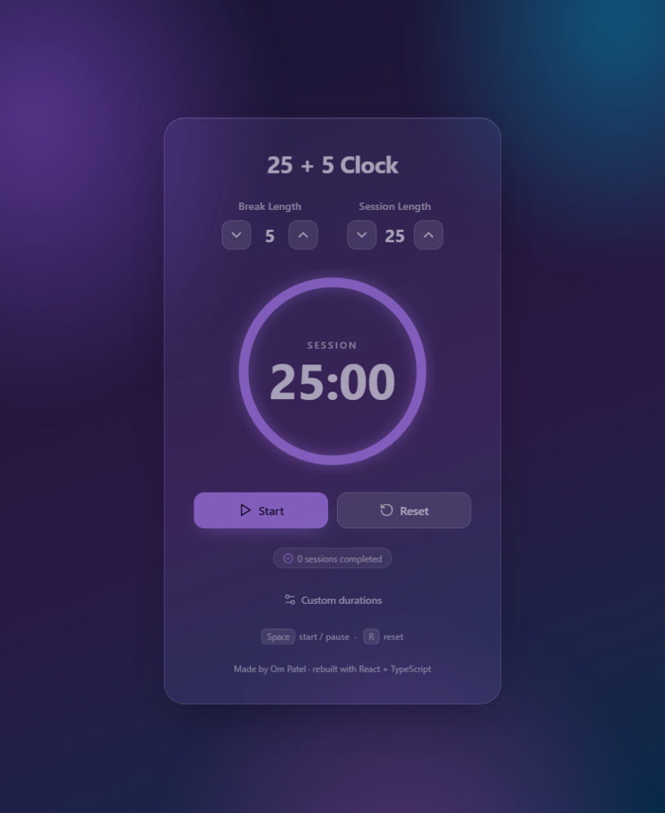
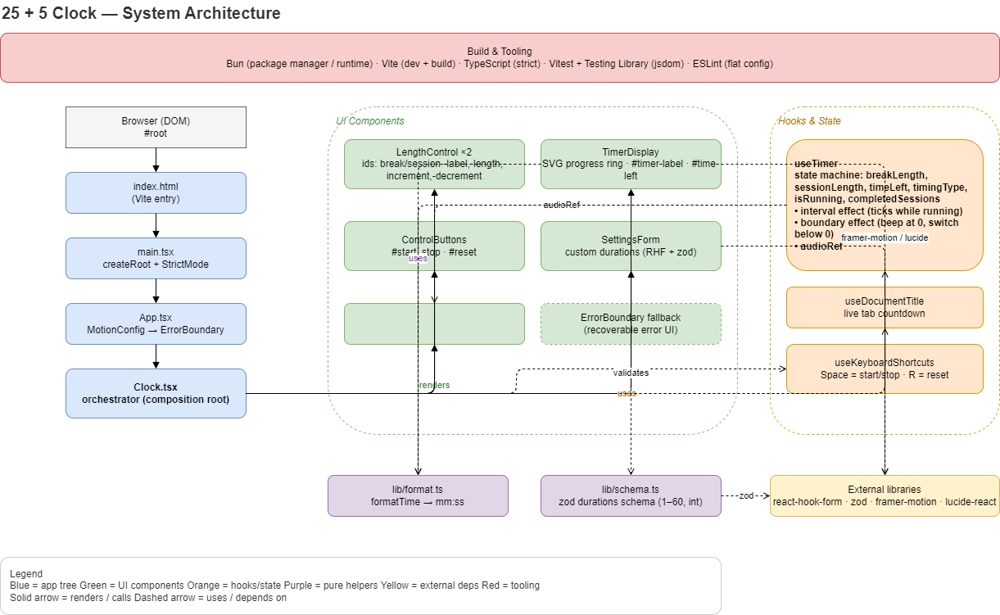

# 25 + 5 Clock

A Pomodoro-style session/break timer built for the
[freeCodeCamp "25 + 5 Clock"](https://25--5-clock.freecodecamp.rocks)
front-end project, rebuilt with a modern toolchain and a glass + gradient UI.

**Live demo:** https://255clockbyom.netlify.app/



## Features

- Session/break countdown that alternates automatically and alarms at `00:00`.
- Adjustable lengths (1–60 min) with steppers, plus a custom-durations form
  where you can type exact minutes (validated with react-hook-form + zod).
- Circular progress ring that depletes as time runs and recolours per phase
  (violet for session, teal for break).
- Live tab-title countdown.
- Keyboard shortcuts: <kbd>Space</kbd> to start/pause, <kbd>R</kbd> to reset.
- Completed-Pomodoro counter.
- Accessible: AA contrast, focus states, and `prefers-reduced-motion` support.
- Passes the full freeCodeCamp test suite.

## Tech stack

| Concern      | Choice                                            |
| ------------ | ------------------------------------------------- |
| Runtime / PM | [Bun](https://bun.sh)                             |
| Build        | [Vite](https://vite.dev) + `@vitejs/plugin-react` |
| Language     | TypeScript (strict)                               |
| UI           | React 19                                          |
| Forms        | react-hook-form + zod                             |
| Animation    | framer-motion                                     |
| Icons        | lucide-react                                      |
| Tests        | Vitest + Testing Library                          |

## Getting started

Requires [Bun](https://bun.sh) 1.3+ (npm works too).

```bash
bun install         # install dependencies
bun run dev         # dev server → http://localhost:5173
bun run build       # type-check + production build → dist/
bun run preview     # serve the production build
bun run test        # run the tests
bun run lint        # lint
```

## Project structure

```
index.html                 Vite entry
public/                     static assets (alarm sound, favicon, images)
src/
  main.tsx                  createRoot + StrictMode
  App.tsx                   MotionConfig → ErrorBoundary → Clock
  components/
    Clock.tsx               composition root
    LengthControl.tsx       reusable minute stepper
    TimerDisplay.tsx        SVG progress ring + mm:ss readout
    ControlButtons.tsx      start/stop + reset
    SettingsForm.tsx        custom-durations form
    ErrorBoundary.tsx
  hooks/
    useTimer.ts             timer state machine
    useDocumentTitle.ts     live tab countdown
    useKeyboardShortcuts.ts Space / R shortcuts
  lib/
    format.ts               mm:ss formatting
    schema.ts               zod durations schema
  styles/index.css          glass + gradient theme
```

## Architecture

A single `useTimer` hook owns all timer state. One interval runs inside an
effect keyed on `isRunning`; a separate effect handles the phase boundary — it
beeps at `00:00`, then switches phase one tick later so the display truly
reaches zero. Components are pure and driven entirely by the hook.



## Running the freeCodeCamp tests

The app keeps every required element id and behaviour. To check it against the
official suite, add the CDN bundle to `index.html` and pick "25 + 5 Clock" from
the test menu:

```html
<script src="https://cdn.freecodecamp.org/testable-projects-fcc/v1/bundle.js"></script>
```

## Deployment

`bun run build` outputs a static site to `dist/`. On Netlify, set the build
command to `bun run build` and the publish directory to `dist`.

## Credits

Made by **Om Patel** — a front-end development enthusiast.
